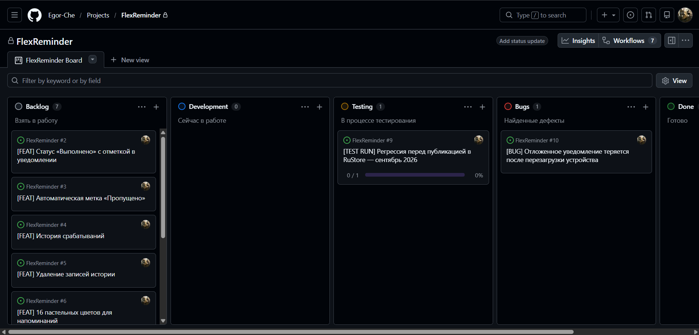

# Гибкие напоминания (FlexReminder)

[](https://github.com/Egor-Che/FlexReminder/actions/workflows/build.yml)

Android-приложение для создания напоминаний с **гибким расписанием**:
произвольные циклы «N дней вкл / M дней выкл» и свободный выбор конкретных дат
в календаре. Работает полностью офлайн, без интернета, с минимумом разрешений.

---

## 🎯 Зачем это приложение

Стандартные календари умеют только простое повторение: каждый день, каждую
неделю, каждый месяц. Но реальные задачи так не работают:

- Курс таблеток: **5 дней прием — 2 перерыв**
- Оплата мобильной связи: **каждые 30 дней**, не по календарю
- Тренировки: **2 дня занимаемся — 1 выходной**
- График работы **2 через 2, или сутки-трое**
- Любые другие произвольные циклы

«Гибкие напоминания» позволяют задать такие расписания и срабатывать
точно в нужные дни и время.

---

## ✨ Возможности

### Гибкое расписание
- **Режим «Интервалы»** — N дней подряд напоминание работает, M дней пауза
- **Режим «Конкретные даты»** — множественный выбор произвольных дат
- **Автосинхронизация режимов** — переключение между интервалами и датами
  с распознаванием простых паттернов

### Уведомления
- Точные будильники (AlarmManager.setExactAndAllowWhileIdle)
- Кнопки **«Выполнено»**, **«Перенести на N»** и **«Пропустить»** прямо в уведомлении
- Настраиваемые интервалы переноса (короткий и длинный) — от 1 минуты до 12 часов
- Беззвучный режим — отдельный канал уведомлений без звука и вибрации
- Автоперепланирование после каждого срабатывания
- Восстановление расписания после перезагрузки устройства

### Звуки
- Встроенная мелодия приложения по умолчанию
- Системные звуки (звонки / уведомления / будильники)
- Свой аудиофайл через SAF
- Индивидуальный звук для каждого напоминания
- Глобальный звук по умолчанию в настройках

### Оформление
- Две темы: **Монохром** (серый) и **Палитра** (16 пастельных цветов)
- Цвет напоминания применяется к карточке, свитчам, календарю
- Строгий архив в серой гамме

### Архив и история
- Автоматическое перемещение напоминаний с истёкшим endDate в архив
- Экран архива с компактными карточками
- История итераций: назначенное и фактическое время, переносы, статусы
- Создание нового напоминания по примеру архивного

### Приватность
- Работает полностью офлайн
- Никакого сбора данных, аналитики, рекламы
- Все напоминания хранятся только на устройстве

---

## 🔒 Разрешения

Приложение запрашивает **минимум разрешений**:

| Разрешение | Зачем |
|---|---|
| `POST_NOTIFICATIONS` | Показ уведомлений (Android 13+) |
| `SCHEDULE_EXACT_ALARM` / `USE_EXACT_ALARM` | Точные будильники |
| `RECEIVE_BOOT_COMPLETED` | Восстановление расписания после перезагрузки |
| `WAKE_LOCK` | Пробуждение устройства для срабатывания |

**НЕ используются:** интернет, камера, контакты, геолокация, микрофон,
файловое хранилище (кроме выбора аудио через SAF).

---

## 🛠 Технологии

| Слой | Технология |
|---|---|
| Язык | Kotlin |
| UI | Jetpack Compose, Material 3 |
| БД | Room (SQLite) |
| Настройки | DataStore Preferences |
| Планировщик | AlarmManager |
| Фоновая работа | WorkManager |
| Сборка | Gradle 8.4 + AGP 8.2.2 |
| CI/CD | GitHub Actions |
| Минимальная версия | Android 9 (API 28) |
| Целевая версия | Android 14 (API 34) |
---

## 📦 Установка

### Скачать готовый APK

1. Перейди во вкладку [Actions](https://github.com/Egor-Che/FlexReminder/actions).
2. Открой последнюю успешную сборку (**зелёная галочка**).
3. Внизу страницы — блок **Artifacts** → скачай `flexreminder-release`.
4. Распакуй архив — внутри `app-release.apk`.
5. Установи на Android-устройство (разреши установку из неизвестных источников).

### Собрать локально

```bash
git clone https://github.com/Egor-Che/FlexReminder.git
cd FlexReminder
./gradlew assembleRelease
```

APK появится в `app/build/outputs/apk/release/`.

---

## 📁 Структура репозитория

```
FlexReminder/
├── .github/
│   ├── workflows/build.yml     # CI-сборка APK
│   └── ISSUE_TEMPLATE/         # шаблоны Issue (bug, feature)
├── app/                        # исходный код Android-приложения
├── docs/
│   ├── design/                 # дизайн-документы подволн
│   └── regression-reports/     # отчёты о регрессии
├── APP_DESCRIPTION.md          # подробное описание приложения
├── TEST_PLAN.md                # план тестирования
├── TEST_CASES.md               # 190+ тест-кейсов
├── CHECKLIST_IMPLEMENTED.md    # чек-лист по готовому
├── CHECKLIST_FUTURE.md         # чек-лист по будущим фичам
├── TRACEABILITY_MATRIX.md      # матрица «требование ↔ тест»
├── REGRESSION_TEMPLATE.md      # шаблон регрессии
├── BACKLOG.md                  # план развития по волнам
└── PROJECT_HISTORY.md          # история архитектурных решений
```

---

## 🧪 Тестирование

Проект ведётся как **пет-проект QA-специалиста**. В репозитории —
полный пакет тестовой документации:

- 📋 [План тестирования](TEST_PLAN.md)
- 🧾 [190+ тест-кейсов](TEST_CASES.md)
- ✅ [Чек-лист реализованного](CHECKLIST_IMPLEMENTED.md)
- 🚧 [Чек-лист будущих фич](CHECKLIST_FUTURE.md)
- 🎯 [Матрица трассировки](TRACEABILITY_MATRIX.md)
- 🔁 [Шаблон регрессии](REGRESSION_TEMPLATE.md)

### Канбан-доска

Управление разработкой и тестированием ведётся на канбан-доске
в GitHub Projects: 5 колонок, milestones по волнам, метки severity/priority.



Активные задачи и баги — в [Issues](https://github.com/Egor-Che/FlexReminder/issues),
полный трекер — в [проекте FlexReminder](https://github.com/users/Egor-Che/projects).

---

## 🗺 План развития

- ✅ **Волна 0** — базовая функциональность
- ✅ **Волна 1.1** — Отметки выполнения (COMPLETED / SKIPPED / автопропуск)
- ✅ **Волна 1.2** — Звуки уведомлений
- ✅ **Волна 1.3** — Цвета и темы (Монохром / Палитра)
- ✅ **Волна 1.4** — Архив и история итераций
- ⏳ **Волна 1.5** — Ресурсы и локализация (служебная)
- ⏳ **Волна 2** — Перенос и шаринг напоминаний
- ⏳ **Волна 3** — Продвинутое планирование (категории, роли по дням)
- ⏳ **Волна 4** — Виджет на рабочий стол
- ⏳ **Волна 5** — Публикация в RuStore

Подробнее — в [BACKLOG.md](BACKLOG.md).

---

## 🏗 Архитектура

Ключевые решения и принципы — в [PROJECT_HISTORY.md](PROJECT_HISTORY.md).
Коротко:

- **Разделение логики и планировщика.** `ReminderLogic` — что вычислять,
  `AlarmScheduler` — как ставить будильник.
- **Два режима расписания.** `INTERVAL` и `CUSTOM_DATES`, переключение без
  потери данных.
- **Единая темизация.** `MaterialTheme` + `AppThemeColors` + `ReminderPalette`.
- **Каналы уведомлений по хэшу звука.** Один уникальный звук = один канал.
- **Архив с автоперемещением.** По истёкшему `endDate`, с закрытием
  pending-итераций.

---

## 📄 Лицензия

Проект распространяется свободно, в личных и некоммерческих целях.

---

## 👤 Автор

**Egor-Che** — разработка и тестирование.

Если проект оказался полезен — поставь ⭐ на GitHub.